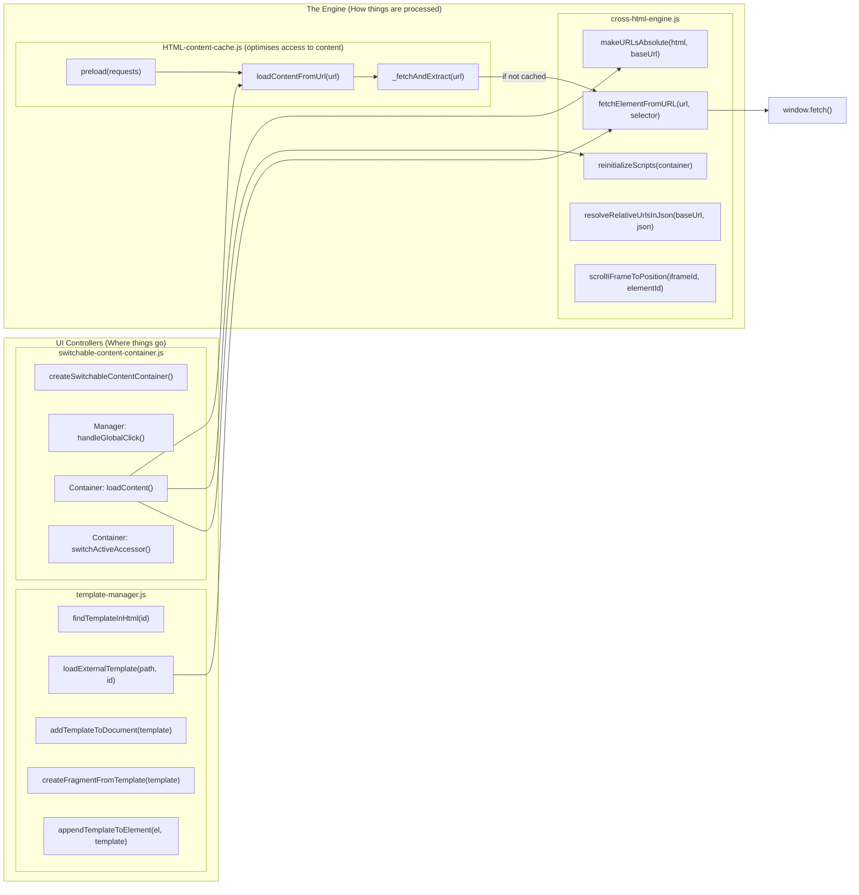

## PHASE 1 - DEFINITION

### 1. XY-Chain:
- avoid double editing

### 2. Description
| **input** | **behaviour** | **constraints** | **output**                            |
|-----------|---------------|-----------------|---------------------------------------|
| element   | write code    | confusion       | have element-copy in another location |

### 3. Rice:
| Reach (#use-cases) | Impact (0-3) | Confidence | Est. Effort |
|--------------------|--------------|------------|-------------|
| 2                  | 2            | 2          | 3h          |
Begin-Time: 2026.04.14, 23:30
Finish-Time: 

-> switch (use-case * impact): 
- ~~<=3: brute-force <= 1h or backlog~~
- 4-6: acceptable solution <= 1day or backlog
- ~~\>=7: elegant solution~~

### 4. Kill Duck: 
am I creating this, only because it ... (strike-through wrong ones)
- ... is intellectually interesting?
- ~~... appears cool?~~  
- ~~... is fun to make?~~  
- ... helps an imaginary future? 
==> I need to be careful, not to overdo the system; just refactor the functions I currently have, but don't built something on top!

# ________

## PHASE 2 - DESIGN

### Research: 
switch (complexity): 
 - **pre-built**: quick-check for reuse
 - ~~**similar**: similarity-table~~ 
 - ~~**custom feature**:~~
 - ~~**custom system**:~~

### Happy-Path: 
- **simple** (<= 1hour): pseudo-code lines
- **default** (<= 1day): flowchart & rubber-duck
- **complex** (week): separate into tasks
- **refactor**: check current documentation, goto corresponding case

### Kill Duck
- am I using this solution, only because it ...
- ... is intellectually interesting?
- ... appears cool?
- ... is fun to make?
- ... helps an imaginary future?
-> any yes = kill

###  Workflow: confirm happy-path
### Happy-Path Summary:

### Edge-Cases: 
- 5 min brainstorm (technical issues, user stupidity, internal curruption) into frequency-impact-time-list: 

| case | **frequency** | **impact** | solution-idea | **solve-time** | solve? |
|------|---------------|------------|---------------|----------------|--------|
|      |               |            |               |                |        |

### implement cases into Solution (from Happy-Path)

### Kill Duck: 
- implementable without further thinking?
- is it "boring"?
  - common patterns?
  - no surprises?
  - obvious error handling?
  - backwards-compatible?

###  Workflow: confirm solution design
### Solution Summary: 

# ________

## PHASE 3 - IMPLEMENTATION

### Happy-Path: 
- implement feature-documentation
- implement solution
- implement happy-path test
- compare with design

###  workflow: test success? continue!

### Edge-Cases: 
- implement edge-case-documentation
- implement edge-case test
- implement solution
    - parameterize if necessary
    - extract if necessary
    - rename new variables/functions
    - no structural changes (= no abstraction, no extra classes)

###  workflow: tests succeed? continue!

# ________

## PHASE 4 - POSTMORTEM:

### compare: 

| planned | executed |
|---------|----------|
|         |          

work problems list: 
- meow

success list: 
- meow

| estimated time | actual time |
|----------------|-------------|
|                |             |

### recheck alternatives

# ________

## PHASE 5 - Feedback: 

Notes: 
- 