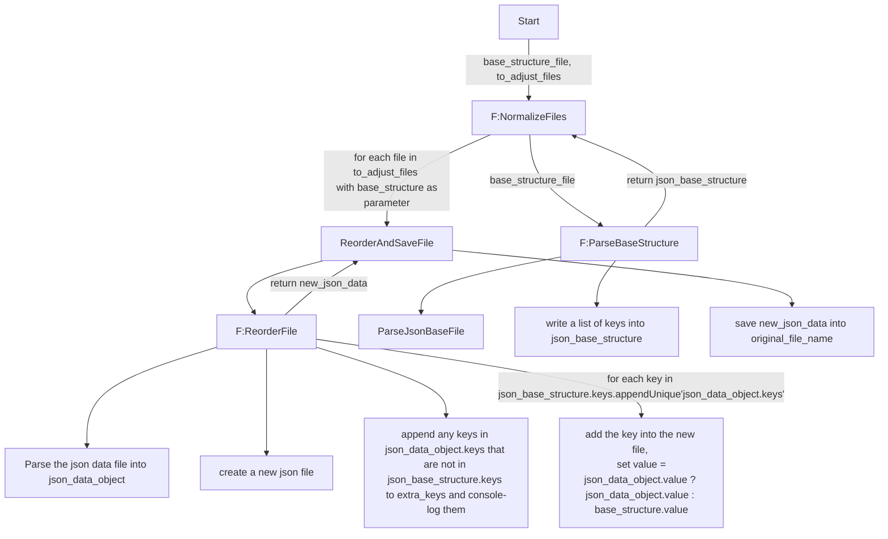
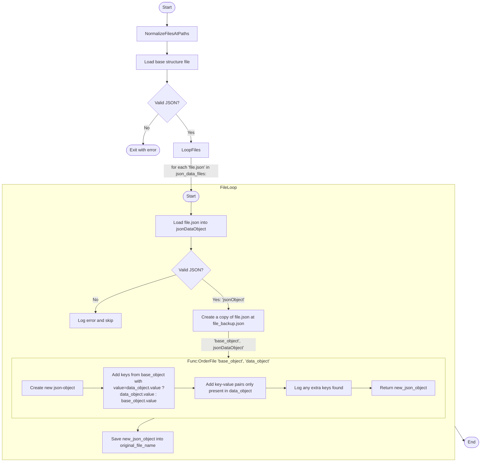
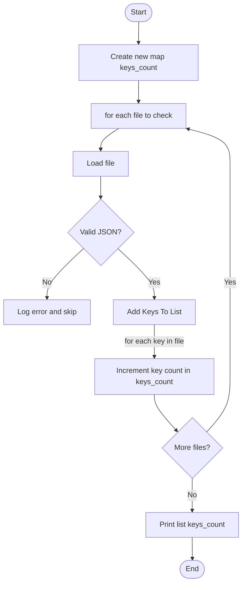
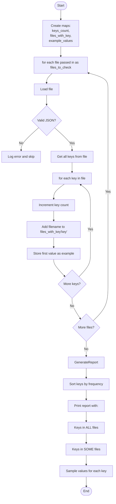

## PHASE 1 - DEFINITION

### 1. XY-Chain:
- keep json files clean

### 2. Description
| **input**       | **behaviour**             | **constraints** | **output**                                                                          |
|-----------------|---------------------------|-----------------|-------------------------------------------------------------------------------------|
| >= 9 json files | scan, reorder, addMissing |                 | json files in same order filled with previous content & markers for missing content |

### 3. Rice:
| Reach (#use-cases) | Impact (0-3) | Confidence | Est. Effort |
|--------------------|--------------|------------|-------------|
| 3                  | 1            | low        | 1.5 hours   |
Begin-Time: 2026-03-03, 15:33
Finish-Time: 2026-04-03, 01:49
Time-Spent: 3.5hours

-> ~~switch (use-case * impact):~~ 
- <=3: brute-force <= 1h or backlog
- ~~4-6: acceptable solution <= 1day or backlog~~
- ~~\>=7: elegant solution~~

### 4. Kill Duck: 
~~am I creating this, only because it ... (strike-through wrong ones)~~
- ... is intellectually interesting?
- ~~... appears cool?~~  
- ~~... is fun to make?~~  
- ... helps an imaginary future? 
-> any yes = backlog

### Summary : 
I could also just manually adjust the json-files, because that wouldn't require me to write a python script. 
However, in any way I need to have a basic structure for the json-file so I could create that, than ask deepseek to write a simple adjustment script; however, if deepseek fails, I should not spend further time on debugging the python script, instead I should just manually adjust, because that will take ~1 hour

# ________

## PHASE 2 - DESIGN

### Research: 
switch (complexity): 
 - ~~**pre-built**: quick-check for reuse~~
 - ~~**similar**: similarity-table~~ 
 - **custom feature**: 
  - research <=min(0.5days, 3 answer) -> comparison table 
  - choose one and test <=(0.5day, acceptable test) -> result table
 - ~~**custom system**:~~

| solution                         | advantage                                               | disadvantage        |
|----------------------------------|---------------------------------------------------------|---------------------|
| create base script layout        |                                                         |                     |
| manually check all files         | extra thought into what is actually needed in the files | checking time       |
| write script to check all files  | quicker for checking & ensures I see everything         | implementation time |
|                                  |                                                         |                     |
| manually rework the json files   |                                                         | manual time         |
| script for reordering json files | automatic                                               | implementation time |
|                                  | can add error-safety                                    |                     |
|                                  |                                                         |                     |

###  Workflow: is research done?
### Research Summary: 

### Happy-Path: 
- ~~**simple** (<= 1hour): pseudo-code lines~~
- **default** (<= 1day): flowchart & rubber-duck
- ~~**complex** (week): separate into tasks~~
- ~~**refactor**: check current documentation, goto corresponding case~~

AI Improved & reworked flowchart

AI improved: 

### Kill Duck
- am I using this solution, only because it ...
- ... is intellectually interesting?
- ... appears cool?
- ... is fun to make?
- ... helps an imaginary future?
-> any yes = kill

### Edge-Cases: 
- 5 min brainstorm (technical issues, user stupidity, internal curruption) into frequency-impact-time-list: 

| case | **frequency** | **impact** | solution-idea | **solve-time** | solve? |
|------|---------------|------------|---------------|----------------|--------|
|      |               |            |               |                |        |

### implement cases into Solution (from Happy-Path)

### Kill Duck: 
- implementable without further thinking?
- is it "boring"?
  - common patterns?
  - no surprises?
  - obvious error handling?
  - backwards-compatible?

###  Workflow: confirm solution design
### Solution Summary: 

# ________

## PHASE 3 - IMPLEMENTATION
==> I hardly implemented anything, I let the AI handle the implementation; however I still had to fix issues & make sure the AI correctly understands what I want. Sometimes it helps to adjust my diagram & to reset the AI such that it can rewrite fully instead of making weird adjustments. 

### Happy-Path: 
- implement feature-documentation
- implement solution
- implement happy-path test
- compare with design

###  workflow: test success? continue!

### Edge-Cases: 
- implement edge-case-documentation
- implement edge-case test
- implement solution
    - parameterize if necessary
    - extract if necessary
    - rename new variables/functions
    - no structural changes (= no abstraction, no extra classes)
==> Might have overlooked edge-cases again. But mostly I forgot to tell the AI how it is supposed to structure my code. Maybe I should write what the functions are supposed to do and then hand it over to the AI. 

###  workflow: tests succeed? continue!

# ________

## PHASE 4 - POSTMORTEM:

### compare: 

work problems list: 
- AI was coding weird stuff that didn't work as intended, because it didn't always understand what I wanted & I have a hard time to tell AI what to improve & how; e.g. telling it "instead of function X, write function Y", it just gives out both function. Also without writing the bare-bones structure of the actual code myself (e.g. maybe just pseudo-code) I'm not able to completely think through how the code-functions (not functionality) should be structured. 
- did not learn python while implementing the solution. 

success list: 
- avoided a lot of manual work
- AI did write my functions, thus I didn't need to learn python for this

| estimated time | actual time |
|----------------|-------------|
| 1.5 hours      | 3.5 hours   |
==> setting up the AI to create the whole code-structure took way longer than expected. 
I'm not sure whether the flow-chart-approach is the correct approach or it might be better to write pseudo-code instead

### recheck alternatives
==> manuall adjustment of files could have worked, but I don't know how long it would have actually taken & how much I would have been confused during that process. 

# ________

## PHASE 5 - Feedback: 

Notes: 
- 