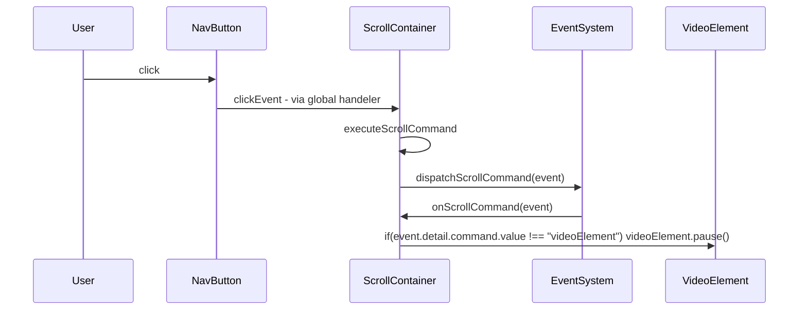

## PHASE 1 - DEFINITION

### 1. XY-Chain:
- visually showcase project

### 2. Description
| **input**            | **behaviour** | **constraints**   | **output**               |
|----------------------|---------------|-------------------|--------------------------|
| some part of project | show to user  | first look impact | visually present project |

### 3. Rice:
| Reach (0-3) | Impact (0-3) | Confidence | Est. Effort |
|-------------|--------------|------------|-------------|
| 3           | 3            | low        | 2hours      |

-> switch (use-case * impact): 
- <=3: brute-force <= 1h or backlog
- 4-6: acceptable solution <= 1day or backlog
- \>=7: elegant solution

### 4. Kill Duck: 
am I creating this, only because it ... (strike-through wrong ones)
- ~~... is intellectually interesting?~~
- ... appears cool?  
- ~~... is fun to make?~~  
- ~~... helps an imaginary future?~~ 
-> any yes = backlog

### Result: be careful not to make something that only appears cool!

# ________

## PHASE 2 - DESIGN

### Research: 
switch (complexity): 
 - ~~**pre-built**: quick-check for reuse~~
 - **similar**: similarity-table 
 - ~~**custom feature**:~~ 
  - ~~research <=min(0.5days, 3 answer) -> comparison table~~ 
  - ~~choose one and test <=(0.5day, acceptable test) -> result table~~
 - ~~**custom system**~~:
   - ~~research <=(2days, 3 answers) -> comparison table~~
   - ~~choose 2 test each <=(1.5 days, acceptable test) -> result table~~

| solution     | similarity                   | difference           |
|--------------|------------------------------|----------------------|
| project card | showcase project in one look | relevance/importance |
|              |                              | side-info            |
|              |                              |                      |
|              |                              |                      |
|              |                              |                      |
|              |                              |                      |
|              |                              |                      |

| Needed Content | Advantage    | Disadvantage                  |
|----------------|--------------|-------------------------------|
| Image          | First-Impact | seems static                  |
|                |              | doesn't lead user to interact |
| Gif            | First-Impact | more effort                   |
|                | Moving       | doesn't lead to interaction   |
| Video          | First-Impact | most effort                   |
|                | Moving       | Too much moving               |
| WebGL-Build    | Interactive  | First-Impact                  |
|                |              |                               |
|                |              |                               |
|                |              |                               |
=> thumbnail: 10-15sec video/gif that showcases the project
on-hover show-controls controls: 
- play/pause
- try yourself (switch to webGL-build)

### Happy-Path: 
- ~~**simple** (<= 1hour): pseudo-code lines~~
- **default** (<= 1day): flowchart & rubber-duck
- ~~**complex** (week): separate into tasks~~
- ~~**refactor**: check current documentation, goto corresponding case~~

### Kill Duck
- am I using this solution, only because it ...
- ~~... is intellectually interesting?~~
- ~~... appears cool?~~
- ~~... is fun to make?~~
- ... helps an imaginary future?
-> doesn't look overly fancy, but it gets the job done

### NOWZyKa Workflow: confirm happy-path

### Edge-Cases: 
- 5 min brainstorm (technical issues, user stupidity, internal curruption) into frequency-impact-time-list: 

| case                          | **frequency** | **impact** | **solution-idea**            | **solve-time** | solve?     |
|-------------------------------|---------------|------------|------------------------------|----------------|------------|
| wrong-id for scroller         | 0             | 3          | add to test                  | 5min           | yes        |
|                               |               |            | additional prev/next-buttons | 5min           | yes        |
| webGL/video doesn't load      | 2             | 3          | add "alt"                    | 5min           | yes        |
|                               |               |            | add to test                  | 5min           | yes        |
| gif/video plays in background | 3             | 2          | ignore                       | 0min           | yes        |
|                               |               |            | auto-pause on other button   | ?              | test       |
| user doesn't notice buttons   | 1             | 3          | highlight currently active   | ?              | test-later |
|                               |               |            | wait for feedback            | 0 min          | YES        |
|                               |               |            | extra-hover on image         | 10min          | test-later |
|                               |               |            |                              |                |            |
|                               |               |            |                              |                |            |
=> add wrong-id & webGL/video-playing to test

| issue/solution                                                                   | advantage                    | disadvantage                  |
|----------------------------------------------------------------------------------|------------------------------|-------------------------------|
| dont use gif, use video                                                          | easiest                      | requires video instead of gif |
|                                                                                  |                              |                               |
| play/pause gif via overlayed other element                                       | works for gif                | implementation time           |
| - https://css-tricks.com/pause-gif-details-summary/                              |                              |                               |
| play/pause via giffing the background                                            | pauses gif in corrent moment | implementation time           |
| - https://codepen.io/cdrs/pen/pGgmPw                                             |                              | gif-to-img-time               |
| specific gif-player                                                              | can pause/play gifs          | implementation TIME           |
| - https://www.javaspring.net/blog/can-you-control-gif-animation-with-javascript/ | automatically processes gif  |                               |
|                                                                                  |                              |                               |
=> use video over gif (if necessary, fake gif via controls)

### Kill Duck: 
- ~~implementable without further thinking?~~
- ~~is it "boring"?~~
  - ~~common patterns?~~
  - ~~no surprises?~~
  - ~~obvious error handling?~~
  - ~~backwards-compatible?~~

==> LaterZyKa creating all of this takes forever, when I already clearly know my plan, because I have tested it; I have probably done this the wrong way round, as I first tested my plan, then noted it down properly. 

# ________

## PHASE 3 - IMPLEMENTATION

### Happy-Path: 
- ~~implement feature-documentation~~
- ~~implement solution~~
- ~~implement happy-path test~~
- ~~compare with design~~  
==> didn't implement feature documentation beforehand
==> haven't yet checked how test automation works
==> strayed from design by putting video play/pause on the button at the bottom

### NowZyKa workflow: test success? continue!

### Edge-Cases: 
- ~~implement edge-case-documentation~~
- ~~implement edge-case test~~
- ~~implement solution~~
    - ~~parameterize if necessary~~
    - ~~extract if necessary~~
    - ~~rename new variables/functions~~
    - ~~no structural changes (= no abstraction, no extra classes)~~
=> full edge-case avoidance (e.g. ensuring video/webGL breaking don't lead to general break) would be a ton of extra work

### NowZyKa workflow: tests succeed? continue!

# ________

## PHASE 4 - POSTMORTEM:

work problems list: 
- strayed from the plan a few times 
  - research: on-hover -> show controls etc., but later no controls
  - visual-plan: play-pause as element in middle, but later no element in middle ==> could still implement
- flowchart etc. took a lot of time
  - most flowcharted feature were already tested beforehand & not too complicated (e.g. scroll-container sending event)  
  ==> I probably shouldn't flowchart simple already tested features
  - coded during testing phase
  ==> some coding must be allowed to test/learn what I read online
- didn't implement all edge-case solution, because they weren't added to the visual/flowchart

success list: 
- considerations at start, helped clear thoughts and focus on one specific plan
- implementation worked mostly friction-free due to
  - properly researched how things work
  - tested in a different file on small scale first
  - had a visual plan in front of me

| estimated time | actual time |
|----------------|-------------|
| 2 hours        | 1day        | 
==> see above, some stuff took longer than it should; 
==> but also having a clear visual & structural plan instead of wildly coding made work more pleasant

==> this whole workstep was not planned into my miro-todo-structure

### recheck alternatives

# ________

## PHASE 5 - Feedback: 

Notes: 
- 